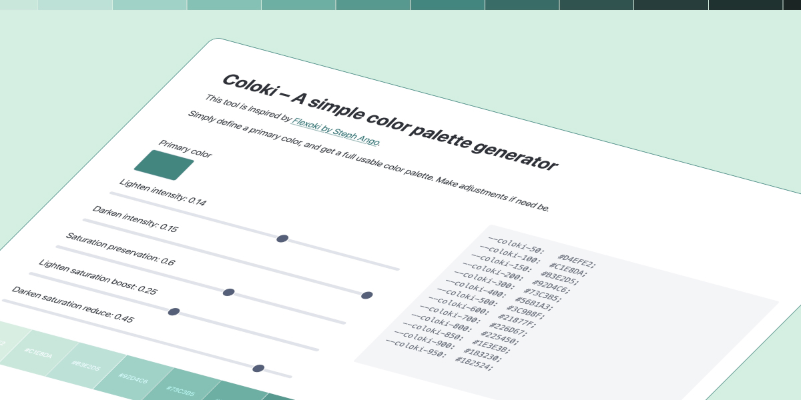

# Coloki

A simple, minimal color palette generator inspired by [Flexoki](https://stephango.com/flexoki). Generate beautiful, perceptually-balanced color scales from a single base color.



## Features

- **Single-file simplicity** - No build process, just open `index.html` in a browser
- **Real-time preview** - See your palette update instantly as you adjust settings
- **Saturation curves** - Lighter colors stay vibrant, darker colors naturally desaturate
- **Extreme color softening** - Gentle curves prevent overly harsh extremes at the lightest and darkest ends
- **CSS output** - Copy-ready CSS custom properties for your design system
- **13-step scale** - From 50 (lightest) to 950 (darkest) with your base color at 600

## How it works

Coloki generates a full color palette by:

1. **Starting from your base color (600)** - The anchor point of your palette
2. **Generating lighter shades (50-500)** - Progressive lightening with optional warm color multiplication to preserve saturation
3. **Generating darker shades (700-950)** - Progressive darkening with automatic desaturation
4. **Applying saturation curves** - Lighter colors get a saturation boost, darker colors get reduced saturation
5. **Softening extremes** - The most extreme colors (50, 100, 900, 950) are affected less to prevent harsh transitions

This creates perceptually-balanced color scales that feel natural and work well across light and dark themes.

## Controls

### Basic Controls
- **Primary color** - Your base color (maps to 600 in the scale)
- **Lighten intensity** (0.05-0.20) - How much lighter the light colors get
- **Darken intensity** (0.05-0.15) - How much darker the dark colors get

### Saturation Controls
- **Saturation preservation** (0.0-1.0) - Blends light colors with warm off-white to retain vibrancy
  - 0.0 = No preservation (colors become washed out)
  - 1.0 = Full preservation (maximum warmth)
- **Lighten saturation boost** (0.0-0.5) - Extra saturation added to lighter colors
- **Darken saturation reduce** (0.0-0.5) - Saturation removed from darker colors

## Customizing defaults

Edit the constants at the top of `coloki.js`:

```javascript
// Default values - adjust these to change starting settings
const DEFAULT_COLOR = "#21877F";
const DEFAULT_LIGHTEN_INTENSITY = 0.14;
const DEFAULT_DARKEN_INTENSITY = 0.15;
const DEFAULT_SATURATION_AMOUNT = 0.6;  // 0.0 = no preservation, 1.0 = full preservation
const DEFAULT_LIGHTEN_SATURATION_BOOST = 0.25;  // Boost saturation on lighter colors (0.0-0.5)
const DEFAULT_DARKEN_SATURATION_REDUCE = 0.45;  // Reduce saturation on darker colors (0.0-0.5)

// Curve adjustments - reduce extreme effects on the most extreme colors
const CURVE_EXTREME = 0.85;  // Effect on most extreme colors (50 and 950): 0.5-1.0
const CURVE_SECOND = 0.9;   // Effect on second extreme colors (100 and 900): 0.5-1.0
```

## Using the generated palette

The tool outputs CSS custom properties that you can copy directly into your stylesheet:

```css
--coloki-50:  #E5F2F0;
--coloki-100: #CCE5E2;
--coloki-150: #B3D8D3;
--coloki-200: #9ACBC5;
--coloki-300: #68B1A8;
--coloki-400: #479E94;
--coloki-500: #349287;
--coloki-600: #21877F;
--coloki-700: #1A6D67;
--coloki-800: #14514D;
--coloki-850: #11413D;
--coloki-900: #0D302D;
--coloki-950: #0A201E;
```

Then use them in your CSS:

```css
.button-primary {
  background: var(--coloki-600);
  color: white;
}

.button-primary:hover {
  background: var(--coloki-700);
}
```

## File structure

```
coloki/
├── index.html       # Main HTML file with UI
├── coloki.js        # Color generation logic
├── inspiration.js   # Reference implementation (Flexoki)
└── readme.md        # This file
```

## Development

**Repository:** [github.com/vasserdigital/coloki](https://github.com/vasserdigital/coloki)

To contribute or report issues, please visit the GitHub repository.

## Credits

Made by [Vasser](https://www.vasser.no) (Eddie Dale).

Inspired by [Flexoki](https://stephango.com/flexoki) by Steph Ango. Coloki simplifies the color generation approach while maintaining the core principles of perceptually-balanced color scales.

## License

MIT
